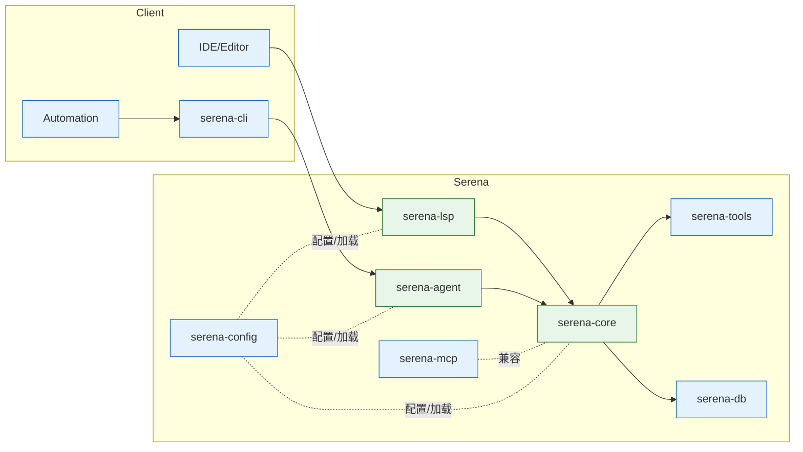

# Serena 集成总览与架构图

本文提供 Serena 在本仓库中的整体架构、关键组件、典型数据流与集成边界，帮助你在 CLI、LSP、工具与代理（Agent）三条路径上完成集成与调试。

## 组件总览
- Serena Core（serena-rust/serena-core）：核心执行与会话/任务编排。
- Serena CLI（serena-rust/serena-cli）：命令行入口，便于本地调用、脚本化与集成。
- Serena LSP（serena-rust/serena-lsp）：语言服务器集成，向 IDE/编辑器暴露能力。
- Serena Tools（serena-rust/serena-tools）：工具适配与注册（面向外部系统/命令）。
- Serena MCP 兼容层（serena-rust/serena-mcp）：面向 MCP 生态的兼容适配。
- Serena Agent（serena-rust/serena-agent）：代理执行路径，聚合 Core、Tools、上下文与策略。
- Serena Config（serena-rust/serena-config）：统一配置装载与校验。
- Serena DB（serena-rust/serena-db）：可选的状态/缓存/元数据持久化。
- Serena Bench（serena-rust/serena-bench）：性能测量、基准与回归对比。

## 典型集成路径
- 工具（Tools）路径：通过配置文件注册一个或多个外部工具（进程/HTTP/本地脚本），由 Core/Agent 调用。
- LSP 路径：将 Serena 作为 LSP 服务端，接入 IDE，提供代码智能、跳转、补全等。
- 代理（Agent）路径：以 Serena Agent 作为统一入口，串联会话、工具、上下文与策略。

## 架构图（Mermaid）

## 数据流概览
1. 入口：CLI/LSP/Agent 接收请求或事件。
2. 解析与路由：根据配置（serena-config）与策略选择执行计划。
3. 执行：Core 协调上下文、调用 Tools 或 MCP 适配，必要时读写 DB。
4. 返回：统一结果格式返回到调用侧（CLI/LSP/Agent）。

## 与 MCP/旧管理器的关系
- Serena 提供 MCP 兼容层以便平滑迁移；推荐逐步替换为 Serena 原生配置与调用路径。
- 详见《迁移指南 从 MCP 与旧管理器到 Serena 原生路径》。

## 目录与入口
- 代码：serena-rust/* 子包。
- 文档：docs/*.md。
- 示例：examples/* 覆盖工具、LSP、代理三条路径。

## 下一步
- 按需选取一条路径在 examples/ 中运行最小样例，验证环境后再扩展复杂度。

